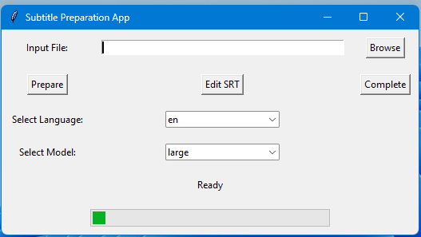

# Generate Subtitle GUI

## Overview

`Generate Subtitle GUI` is an application that extracts audio from video files, generates subtitles using the Whisper model, and allows you to merge these subtitles back into the video. It features a graphical user interface for easy interaction and editing of subtitle files before finalizing.



## Features

- **Extract Audio**: Extracts audio from video files.
- **Generate Subtitles**: Uses the Whisper model to generate subtitles from the extracted audio.
- **Edit Subtitles**: Provides a built-in editor for modifying subtitles before finalizing.
- **Merge Subtitles**: Merges the subtitles back into the original video.
- **Language Support**: Automatically detects and supports multiple languages for transcription.

## Requirements

- Python 3.x
- `ffmpeg-python`
- `faster-whisper`
- `tkinter` (comes with Python)
- `PyInstaller` (for packaging)

## Installation

1. **Clone the Repository**

   ```bash
   git clone https://github.com/shaweesh/generate-subtitle-gui.git
   cd generate-subtitle-gui
   ```

2. **Create and Activate Virtual Environment**

   ```bash
   python -m venv venv
   source venv/bin/activate  # On Windows use `venv\Scripts\activate`
   ```

3. **Install Dependencies**

   ```bash
   pip install -r requirements.txt
   ```

## Additional Files

Ensure the following additional files are present in the project directory:

- **`config.json`**: Configuration file for saving user settings.
- **`icon.ico`**: Icon file for the GUI application.
- **`main.py`**: Script responsible for generating subtitles.
- **`merge_srt.py`**: Script responsible for merging subtitles with the video.

## Usage

1. **Run the Application**

   ```bash
   python app.py
   ```

   This will open the GUI application.

2. **Using the GUI**

   - **Browse**: Choose the video file you want to process.
   - **Prepare**: Extracts audio, generates and saves subtitles. You can edit the subtitles using the provided editor.
   - **Edit Subtitles**: After preparing the SRT file, click the "Edit SRT" button to modify the subtitles. Save changes to keep your edits.
   - **Complete**: Merges the edited subtitles back into the video and saves the output file.

3. **Configuration**

   The application allows you to select the language for transcription. The selected language will be saved and used for future sessions.

## Building the Executable

To create a standalone executable from the application:

1. **Install PyInstaller**

   ```bash
   pip install pyinstaller
   ```

2. **Build the Executable**

   ```bash
    pyinstaller --onefile --windowed --add-data "main.py;." --add-data "merge_srt.py;." app.py
   ```

   This will create a single executable file in the `dist` directory.

3. **Verify the Executable**

   Test the executable located in the `dist` directory to ensure it functions as expected and includes all necessary files and dependencies.

## Contributing

If you would like to contribute to this project, please fork the repository and submit a pull request with your changes. For major changes, please open an issue to discuss what you would like to change.

## License

This project is licensed under the MIT License - see the [LICENSE](LICENSE) file for details.

## Acknowledgements

- **Whisper Model**: [Faster Whisper](https://github.com/guillaumela/faster-whisper)
- **FFmpeg**: [FFmpeg](https://ffmpeg.org/)
